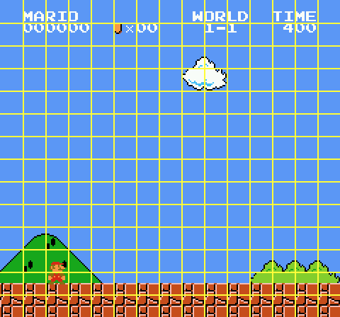

NES-Solve
==

NES-Solve is a GPU-based Nintendo Entertainment System emulator written in CUDA, with a Python API. Its intended use case is data generation for reinforcement learning. It currently does not have a general-purpose API, since it is hard-coded to my experiments around certain convolutions.

`NESSolve.run` takes as input a filename to a game ROM and a *num_instances* x *num_actions* matrix consisting of the sequence of button presses each instance should make per frame, and outputs an array of size *num_instances* x *num_actions* x 256/*kernel_width* x 240/*kernel_height* containing the kernel activations seen in each instance.

It currently supports Mapper 0 games. It will have Mapper 1 support but I'm only really interested in a couple of games so I won't be adding mappers beyond that. I plan on adding a random forest engine in order to "inline" agents.

It's not yet clear whether this GPU-based approach is a win vs spending similar effort on a SIMD-style/cache-optimized CPU-based NES emulator, but it is better given my use case and resources, since GPUs are easier to come by than high core count CPUs.

The key optimization challenge is that the NES deals with random access on memory on the scale of kilobytes to tens of kilobytes, which is too large to use any kind of straightforward memory locality. But since this is the first CUDA program I've written there is no doubt a lot of low-hanging fruit.

Frame Data
---

NES-Solve can generate frames. Ideally we would want to generate PyTorch tensors on-device, but I'm not doing standard vision-based learning at the moment so such a feature isn't implemented.

Block Score
--

Some of my experiments revolve around what I call the Block Score. See [here](http://ec2-54-176-62-21.us-west-1.compute.amazonaws.com/) for a live demonstration. The block score is the number of unique rectangles seen by a game instance. In the following screen, the sky blocks all together count as 1 since they're all the same, while the cloud counts as 4 since each of its 4 tiles are unique.

    

The intuition behind the block score is as follows. First, it has less variance than the human-chosen game score, which is spikier and more prone to pathological scenarios. Second, humans are generally not good at designing score systems<i>no sense of irony</i>, so a more human-agnostic measure seems better to me.

Third, games are visual and designed for humans to enjoy. The general characteristics of games as entertainment implies that greater progress through a game involves greater visual entropy, so to speak. A game's score system is often just a way of adding texture, but is otherwise not a significant element.

I may be totally wrong on all of these points, but I'll worry about that later. Note that the block score actually does account for the human-given score to some degree. Particular kernel sizes or offsets will allow the digital score shown on the screen to be tracked logarithmically, which is about right. And for example, in Super Mario Bros small +100 tokens appear near events, which will count if they are unique.

Language
--

Other related experiments involve thinking of the commands/button presses given to a game as a "language." I'm particularly curious about the kind of information that can leak from the game world to the language world, using only the score and the given command sequences themselves.

Think of it as trying to side-channel attack the game.

This gets to the heart of a lot of problems. It's similar to the problem faced by regular NLP where models are trained on the "language world" data and not directly on the real world itself.

In the case of games, if we have a certain set of command inputs which map to a certain set of scores, there is a large theoretical space of games which all correspond to that same mapping or game progress, even though the underlying games could be considered different by human players. A trivial example would be a stateful Dance Dance Revolution style song whose button presses exactly match the button presses needed to pass any given stage of any given game.

Likewise for human languages, there exists a large space of theoretical worlds that are indistinguishable at the language level because they emit the same string of language expressions, even more so if we allow "isomorphism" in languages.

This is the perspective that machine learning methods are coming from when we apply them to language. We are trying to side-channel attack the underlying world through abstract sequences of words, with the mathematical universe accounting for an infinite set of possible underlying worlds.
